# Áp dụng các thuật toán tìm kiếm và tối ưu để giải bài toán 8-puzzle và cờ Caro 3x3

# 1. Tổng quan về đề tài

## 1.1. Tổng quan về bài toán 8 puzzle và cờ Caro 3x3

- **Bài toán 8 puzzle**: Là một trò chơi xếp số trên lưới 3x3, bao gồm 8 ô số (từ 1 đến 8) và 1 ô trống. Mục tiêu của trò chơi là di chuyển các ô số từ trạng thái ban đầu đến trạng thái mục tiêu (thường là xếp theo thứ tự tăng dần: 1-2-3, 4-5-6, 7-8-trống) bằng cách trượt ô trống lên, xuống, trái hoặc phải. Trò chơi này là một bài toán cổ điển trong trí tuệ nhân tạo, yêu cầu tìm kiếm và tối ưu hóa để xác định cách di chuyển các ô số sao cho đạt được mục tiêu trong số các bước di chuyển hợp lý nhất.
- **Trò chơi Caro 3x3 (Tic-Tac-Toe)**: Để áp dụng các thuật toán tìm kiếm đối kháng (Adversarial Search), bài toán 8-puzzle tĩnh không còn phù hợp. Vì vậy, dự án chuyển đổi sang trò chơi Caro 3x3. Đây là môi trường đối kháng trực tiếp giữa hai người chơi (X và O) trên lưới 3x3. Mục tiêu của mỗi bên là xếp được 3 quân cờ của mình thẳng hàng (ngang, dọc hoặc chéo) trước đối thủ.

## 1.2. Mục đích

Dự án này áp dụng các thuật toán tìm kiếm và tối ưu trong trí tuệ nhân tạo để giải quyết bài toán 8-puzzle và cờ Caro 3x3, với mục đích tối ưu hóa quá trình tìm kiếm và giải quyết vấn đề. Cụ thể, dự án triển khai 6 nhóm thuật toán chính: Tìm kiếm không có thông tin (Uninformed Search), Tìm kiếm có thông tin (Informed Search), Tìm kiếm cục bộ (Local Search), Tìm kiếm trong môi trường phức tạp (Complex Environments), Bài toán thỏa mãn ràng buộc (CSPs), và Tìm kiếm đối kháng (Adversarial Search). Các thuật toán được tích hợp trên một giao diện đồ họa (GUI) tương tác thời gian thực phong cách Material Design 3, kèm theo nhật ký thực hiện chi tiết (Execution Log) và thống kê hiệu năng (số nút sinh ra, thời gian thực thi, độ sâu giải pháp), giúp người học hiểu rõ và so sánh trực quan hiệu quả của từng phương pháp.

## 1.3. Cấu trúc Thư mục

Dưới đây là sơ đồ cấu trúc thư mục của dự án:

```text
DoAnCaNhan/
│
├── algorithms/                    # Thư mục chứa mã nguồn thuật toán
│   ├── __init__.py                # Khởi tạo package algorithms
│   ├── bfs.py                     # Thuật toán Breadth-First Search (BFS)
│   ├── dfs.py                     # Thuật toán Depth-First Search (DFS)
│   ├── ucs.py                     # Thuật toán Uniform Cost Search (UCS)
│   ├── ids.py                     # Thuật toán Iterative Deepening Search (IDS)
│   ├── astar.py                   # Thuật toán A* Search
│   ├── greedy.py                  # Thuật toán Greedy Best-First Search
│   ├── ida_star.py                # Thuật toán Iterative Deepening A* (IDA*)
│   ├── simple_hill_climbing.py    # Thuật toán Simple Hill Climbing
│   ├── steepest_hill_climbing.py  # Thuật toán Steepest-Ascent Hill Climbing
│   ├── stochastic_hill_climbing.py# Thuật toán Stochastic Hill Climbing
│   ├── simulated_annealing.py     # Thuật toán Simulated Annealing
│   ├── random_restart_hc.py       # Thuật toán Random Restart Hill Climbing
│   ├── local_beam_search.py       # Thuật toán Local Beam Search
│   ├── complex_environmental_search.py # AND-OR, Sensorless, Partially Observable Search
│   ├── csp_search.py              # AC-3, Backtracking CSP, Forward Tracking, Min-Conflicts
│   └── adversarial_search.py      # Minimax, Alpha-Beta Pruning, Expectimax (Caro 3x3)
│
├── assets/                        # Thư mục chứa tài nguyên hình ảnh và biểu đồ
│   ├── GIF/                       # Chứa các file ảnh động (GIF) minh họa thuật toán
│   ├── benchmark_data.json        # Dữ liệu kết quả đo lường benchmark
│   └── comparison_*.png           # Các biểu đồ so sánh hiệu năng thuật toán
│
├── UI.py                          # File chính khởi chạy giao diện Desktop (pywebview)
└── README.md                      # Tài liệu hướng dẫn và báo cáo dự án
```

## 1.4. Không gian trạng thái

- **8-puzzle**: Tổng số cấu hình có thể là $9! = 362,880$, trong đó đúng một nửa ($181,440$) là khả thi (giải được) dựa trên tính chất hoán vị chẵn/lẻ. Mỗi trạng thái có từ 2 đến 4 hành động di chuyển ô trống.
- **Caro 3x3**: Số lượng trạng thái tối đa trên lưới 3x3 là $3^9 = 19,683$, tuy nhiên số lượng trạng thái trò chơi thực tế nhỏ hơn rất nhiều do lượt đi luân phiên và điều kiện dừng khi có người thắng.

## 1.5. Độ phức tạp

- **Thời gian**: Phụ thuộc vào thuật toán, từ $O(b^d)$ (với $b$ là hệ số nhánh, $d$ là độ sâu) đối với các tìm kiếm mù, cho đến các độ phức tạp tối ưu hơn khi áp dụng heuristic kinh nghiệm hay cắt tỉa đối kháng.
- **Không gian**: Từ $O(d)$ đối với các thuật toán tiết kiệm bộ nhớ (DFS, IDS, IDA*) cho đến $O(b^d)$ đối với các thuật toán lưu trữ toàn bộ cây tìm kiếm (BFS, A*).

## 1.6 Tính chất

- **Tĩnh / Động**: Môi trường 8-puzzle là tĩnh (không đổi trong quá trình tìm kiếm), trong khi cờ Caro 3x3 là động do đối thủ phản xạ lại nước đi của người chơi.
- **Xác định**: Mỗi hành động dẫn đến một kết quả duy nhất.
- **Rời rạc**: Không gian trạng thái và hành động hoàn toàn hữu hạn và rõ ràng.
- **Khả thi**: Không phải cấu hình 8-puzzle ban đầu nào cũng giải được; hệ thống tự động kiểm tra tính khả thi trước khi thực thi.

---

# 2. Hướng dẫn Cài đặt và Khởi chạy

Dưới đây là hướng dẫn cài đặt các thư viện cần thiết và cách vận hành dự án.

## 2.1. Yêu cầu Hệ thống
- **Hệ điều hành**: Windows 10/11, macOS, hoặc Linux.
- **Python**: Phiên bản **Python 3.8** trở lên.
- **Các thư viện ngoài**:
  - `pywebview`: Thư viện hiển thị giao diện Desktop (HTML/CSS/JS).
  - `matplotlib` & `numpy`: Thư viện dùng cho việc đo lường benchmark và vẽ biểu đồ so sánh hiệu năng.

## 2.2. Hướng dẫn Cài đặt
1. Mở terminal (CMD, PowerShell hoặc Terminal trên Linux/macOS) và di chuyển vào thư mục dự án:
   ```bash
   cd DoAnCaNhan
   ```
2. Cài đặt các thư viện cần thiết bằng lệnh `pip`:
   ```bash
   pip install pywebview matplotlib numpy
   ```

## 2.3. Hướng dẫn Khởi chạy
- **Chạy ứng dụng chính (Giao diện đồ họa tương tác)**:
  ```bash
  python UI.py
  ```
- **Chạy đo lường hiệu năng và cập nhật các biểu đồ so sánh**:
  ```bash
  python scratch/benchmark_and_chart.py
  ```

---

# 3. Nội dung

## 3.1. Tìm kiếm không có thông tin (Uninformed Search)

Tìm kiếm không có thông tin (Tìm kiếm mù) sử dụng các chiến lược duyệt cây/đồ thị mà không có thêm thông tin về mức độ hứa hẹn của các nút ngoại trừ thông tin cấu hình trạng thái hiện tại.
Các thuật toán triển khai bao gồm:

- **BFS (Breadth-First Search)**: Khám phá tất cả các nút ở một mức độ sâu trước khi chuyển sang mức tiếp theo. Đảm bảo tìm ra đường đi ngắn nhất (tối ưu số bước).

  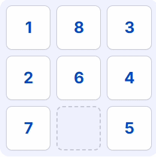
  *Hoạt ảnh BFS - Early Goal Test*

  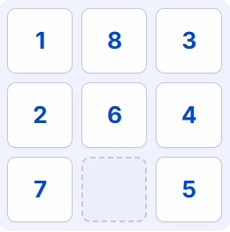
  *Hoạt ảnh BFS - Late Goal Test*
- **DFS (Depth-First Search)**: Duyệt sâu tối đa vào một nhánh trước khi quay lui. Sử dụng giới hạn độ sâu tối đa để tránh lặp vô tận.

  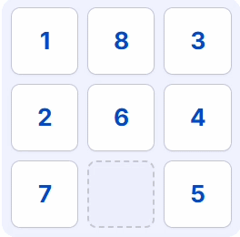
  *Hoạt ảnh DFS - Early Goal Test*

  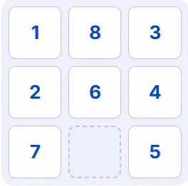
  *Hoạt ảnh DFS - Late Goal Test*
- **UCS (Uniform Cost Search)**: Mở rộng nút có chi phí tích lũy nhỏ nhất. Với 8-puzzle, chi phí mỗi bước đi bằng giá trị của ô số được di chuyển.

  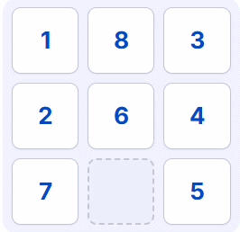
  *Hoạt ảnh UCS*
- **IDS (Iterative Deepening Search)**: Lặp lại DFS với giới hạn độ sâu tăng dần từ 0, kết hợp tính tối ưu của BFS và tính tiết kiệm bộ nhớ của DFS.

  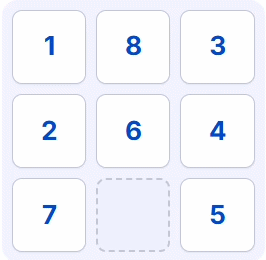
  *Hoạt ảnh IDS*

### Nhận xét

- `BFS`: Luôn đảm bảo tìm thấy giải pháp tối ưu số bước đi, phù hợp cho các cấu hình bắt đầu gần đích. Tuy nhiên, lượng bộ nhớ tiêu thụ tăng theo hàm mũ và dễ bị tràn bộ nhớ nếu độ sâu đích lớn.
- `DFS`: Rất tiết kiệm bộ nhớ do chỉ cần lưu trữ nhánh tìm kiếm hiện tại. Tuy nhiên, nó không đảm bảo tìm thấy đường đi ngắn nhất và có thể bị mắc kẹt sâu trong các nhánh xa lời giải.
- `UCS`: Tìm kiếm tối ưu theo chi phí. Rất hữu ích khi chi phí các bước đi khác nhau (ô số lớn di chuyển tốn nhiều chi phí hơn ô số nhỏ).
- `IDS`: Phù hợp nhất trong nhóm tìm kiếm mù vì nó tìm thấy lời giải tối ưu giống như BFS nhưng chỉ tiêu hao lượng bộ nhớ rất nhỏ tương đương DFS.

---

## 3.2. Tìm kiếm Có Thông Tin (Informed Search)

Sử dụng hàm heuristic $h(n)$ để ước lượng khoảng cách từ trạng thái hiện tại đến đích nhằm định hướng tìm kiếm hiệu quả hơn. Hàm heuristic sử dụng là **Khoảng cách Manhattan**.
Các thuật toán triển khai bao gồm:

- **A\* (A Star Search)**: Sử dụng hàm đánh giá $f(n) = g(n) + h(n)$ để quyết định mở rộng nút. Đảm bảo tìm thấy lời giải tối ưu nếu hàm heuristic là admissible.

  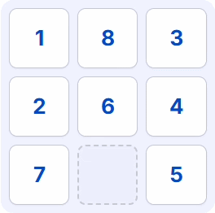
  *Hoạt ảnh A**
- **Greedy Best-First Search**: Chỉ sử dụng hàm heuristic $h(n)$ để quyết định. Ưu tiên đi nhanh nhất đến đích theo ước lượng cảm tính mà bỏ qua chi phí thực tế đã đi.

  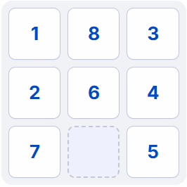
  *Hoạt ảnh Greedy Best-First Search*
- **IDA\* (Iterative Deepening A\*)**: Phiên bản lặp lại sâu dần của A*, sử dụng giới hạn ngưỡng $f(n)$ thay vì giới hạn độ sâu để tiết kiệm bộ nhớ.

  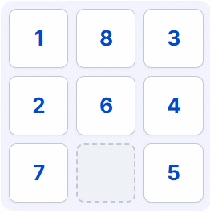
  *Hoạt ảnh IDA**

### Nhận xét

- `A*`: Cực kỳ hiệu quả và luôn đảm bảo tìm thấy giải pháp tối ưu. Số lượng nút duyệt được giảm thiểu đáng kể so với BFS/DFS.
- `Greedy Search`: Tốc độ tìm kiếm rất nhanh và thường sinh ra ít nút hơn cả A* trong nhiều trường hợp, phù hợp khi cần tìm giải pháp nhanh chóng. Tuy nhiên, đường đi tìm được thường không tối ưu.
- `IDA*`: Giải quyết triệt để điểm yếu bộ nhớ của A* bằng cách không lưu trữ danh sách đóng/mở trên RAM, phù hợp cho các bài toán có bộ nhớ giới hạn.

---

## 3.3. Tìm kiếm Cục Bộ (Local Search)

Tập trung vào việc cải tiến trạng thái hiện tại bằng cách đánh giá các nút lân cận mà không cần lưu trữ toàn bộ cây tìm kiếm, giảm độ phức tạp không gian về hằng số $O(1)$.
Các thuật toán triển khai bao gồm:

- **Simple Hill Climbing**: Di chuyển đến nút lân cận đầu tiên có giá trị heuristic tốt hơn trạng thái hiện tại.

  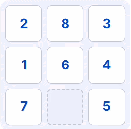
  *Hoạt ảnh Simple Hill Climbing*
- **Steepest-Ascent Hill Climbing**: Đánh giá toàn bộ các trạng thái lân cận và chọn trạng thái có heuristic tốt nhất.

  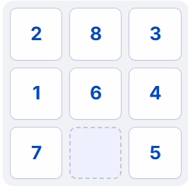
  *Hoạt ảnh Steepest-Ascent Hill Climbing*
- **Stochastic Hill Climbing**: Chọn ngẫu nhiên một trong các trạng thái lân cận tốt hơn trạng thái hiện tại theo xác suất.

  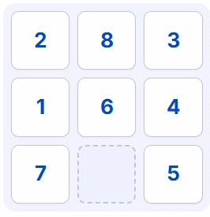
  *Hoạt ảnh Stochastic Hill Climbing*
- **Simulated Annealing**: Sử dụng cơ chế giảm nhiệt độ $T$. Cho phép chấp nhận các bước đi tệ hơn với xác suất $P = e^{-\Delta E / T}$ để có cơ hội thoát khỏi cực trị địa phương.
- **Random Restart Hill Climbing**: Khi bị kẹt tại cực trị địa phương, tự động khởi động lại thuật toán từ một trạng thái ngẫu nhiên hợp lệ mới cho đến khi tìm thấy lời giải.

  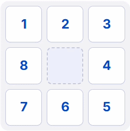
  *Hoạt ảnh Random Restart Hill Climbing*
- **Local Beam Search**: Theo dõi đồng thời $k$ trạng thái tốt nhất. Tại mỗi bước, sinh ra tất cả các nút con của cả $k$ trạng thái này và chọn lại $k$ nút tốt nhất.

  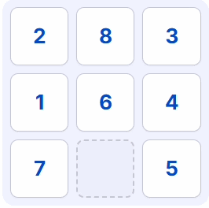
  *Hoạt ảnh Local Beam Search*

### Nhận xét

- Nhóm thuật toán Hill Climbing chạy cực nhanh và tốn ít bộ nhớ nhưng rất dễ bị mắc kẹt tại cực trị địa phương (local optimum), cao nguyên (plateau) hoặc sườn đồi (ridge) và dừng lại mà không tìm được đích.
- `Simulated Annealing` và `Random Restart` cung cấp các cơ chế hiệu quả để thoát khỏi bẫy cực trị địa phương, giúp nâng cao tỷ lệ tìm thấy lời giải thành công.
- `Local Beam Search` tận dụng sức mạnh tập thể của $k$ luồng tìm kiếm song song để chia sẻ thông tin trạng thái tốt, giúp tăng tốc độ tiếp cận đích.

---

## 3.4. Tìm kiếm Phức Tạp (Complex Environments)

Giải quyết các bài toán khi môi trường không chắc chắn, không thể quan sát toàn bộ hoặc có cấu trúc phân nhánh đặc biệt.
Các thuật toán triển khai bao gồm:

- **AND-OR Graph Search**: Giải quyết bài toán trong môi trường không xác định bằng cách xây dựng một cây kế hoạch có các nhánh lựa chọn của Agent (OR) và các phản ứng của môi trường (AND).

  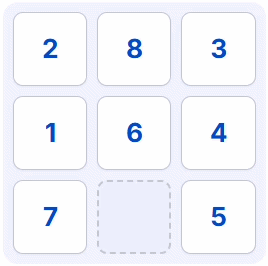
  *Hoạt ảnh AND-OR Graph Search*
- **Belief State (Sensorless / Conformant Search)**: Tìm kiếm khi Agent bị "mù" hoàn toàn (không quan sát được). Thuật toán biểu diễn trạng thái dưới dạng một tập hợp gồm nhiều cấu hình khả thi (Belief State) và tìm chuỗi hành động đưa toàn bộ các cấu hình này về đích.

  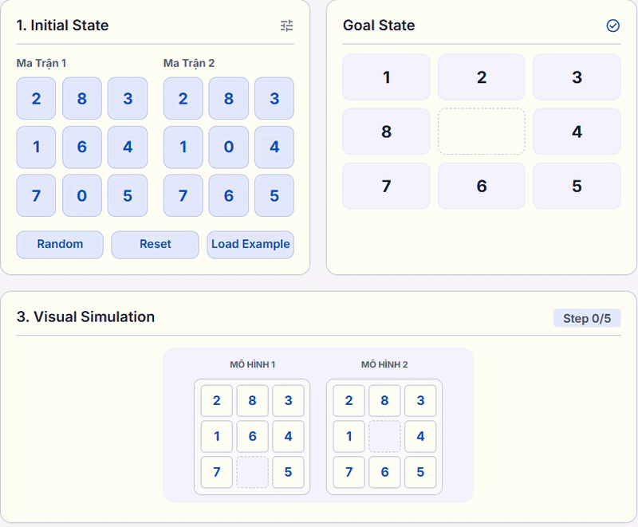
  *Hoạt ảnh Sensorless (Belief State) Search*
- **Belief State & Goal (Partially Observable Search)**: Agent quan sát được một phần (ví dụ: chỉ biết vị trí của ô trống). Thuật toán cập nhật trạng thái niềm tin sau mỗi hành động và kết quả quan sát để thu hẹp dần các cấu hình khả thi cho đến khi đạt đích.

  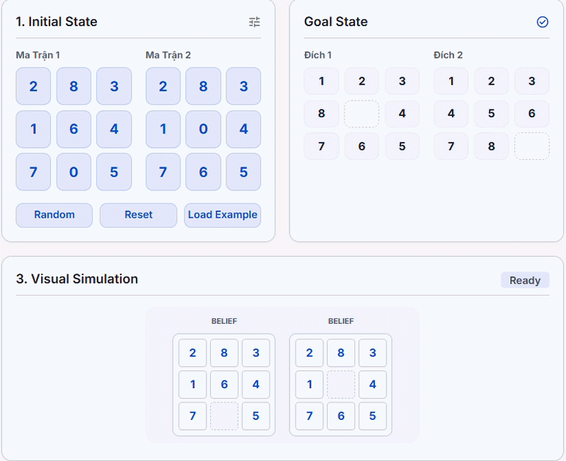
  *Hoạt ảnh Partially Observable Search*

### Nhận xét

- Nhóm thuật toán này giúp kiểm nghiệm các mô hình Agent hoạt động trong điều kiện thiếu thông tin.
- `Sensorless Search` chứng minh rằng một Agent vẫn có thể đạt tới đích xác định mà không cần bất kỳ cảm biến nào bằng cách áp dụng các hành động ép (coercive actions).
- `Partially Observable Search` sử dụng vòng lặp Dự đoán (Predict) và Cập nhật (Update) dựa trên quan sát thực tế để kiểm soát và định hướng hành động hiệu quả.

---

## 3.5. Bài toán Hài Hòa Ràng Buộc (CSPs)

Biến đổi bài toán tìm kiếm thành việc tìm kiếm bộ giá trị cho các biến số sao cho thỏa mãn các ràng buộc định trước. Đối với 8-puzzle, các ô lưới là các biến, miền giá trị là $\{1..8, trống\}$, và các ràng buộc là tính kề cận của bước chuyển dịch.
Các thuật toán triển khai bao gồm:

- **AC-3 (Arc Consistency)**: Kiểm tra và thiết lập tính nhất quán cung tròn giữa các biến để loại bỏ sớm các giá trị không hợp lệ trong miền giá trị.

  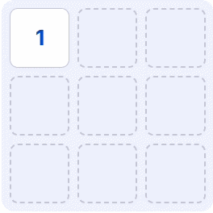
  *Hoạt ảnh AC-3 Arc Consistency*
- **Backtracking Search**: Thuật toán quay lui gán giá trị từng bước cho các biến.

  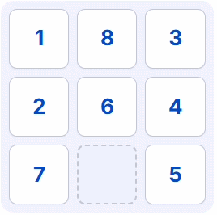
  *Hoạt ảnh Backtracking Search*
- **Forward Tracking**: Kết hợp quay lui với kiểm tra tiến trình (Forward Checking) để nhìn trước các biến chưa gán, loại bỏ các nhánh lỗi trước khi duyệt sâu.

  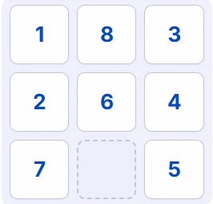
  *Hoạt ảnh Forward Tracking*
- **Min-Conflicts**: Một thuật toán tìm kiếm cục bộ giải quyết CSP bằng cách chọn ngẫu nhiên một biến có xung đột và gán giá trị mới làm giảm thiểu số lượng ràng buộc bị vi phạm.

  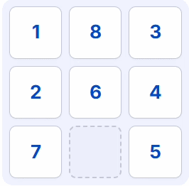
  *Hoạt ảnh Min-Conflicts*

### Nhận xét

- Tiếp cận dưới góc độ CSP giúp tận dụng các cấu trúc ràng buộc để giải quyết bài toán một cách có hệ thống.
- `Forward Checking` giúp cải tiến rõ rệt thuật toán Backtracking cơ bản nhờ khả năng phát hiện sớm các nhánh cụt không thể thỏa mãn ràng buộc.
- `Min-Conflicts` cực kỳ nhanh đối với các bài toán CSP có số biến lớn nhờ cơ chế tối ưu hóa xung đột cục bộ.

---

## 3.6. Tìm kiếm đối kháng (Adversarial Search - Caro 3x3)

Áp dụng cho môi trường có sự cạnh tranh trực tiếp giữa hai Agent (Người chơi X và AI O).
Các thuật toán triển khai bao gồm:

- **Minimax**: AI duyệt toàn bộ cây trò chơi để chọn nước đi tối đa hóa điểm số của mình (Max) và tối thiểu hóa điểm số của đối thủ (Min).

  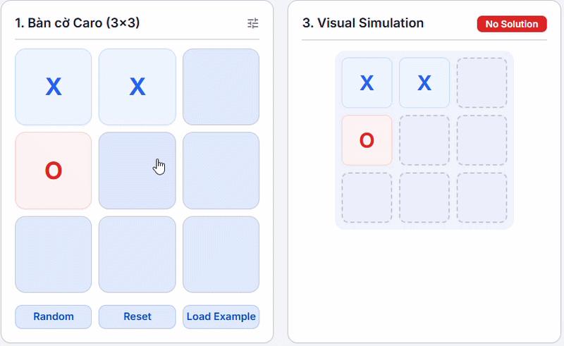
  *Hoạt ảnh Minimax*
- **Alpha-Beta Pruning**: Cắt tỉa các nhánh của cây trò chơi chắc chắn không ảnh hưởng đến quyết định cuối cùng, giúp tăng tốc độ tìm kiếm đáng kể.

  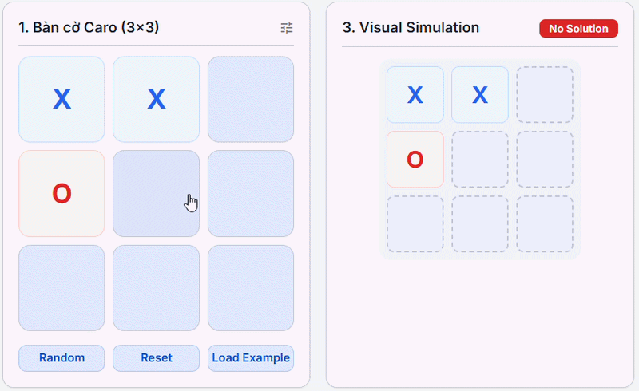
  *Hoạt ảnh Alpha-Beta Pruning*
- **Expectimax**: Sử dụng khi đối thủ không chơi tối ưu hoàn toàn mà di chuyển ngẫu nhiên hoặc có tính chất cơ hội. AI tính điểm trung bình (kỳ vọng) tại các nút của đối thủ.

  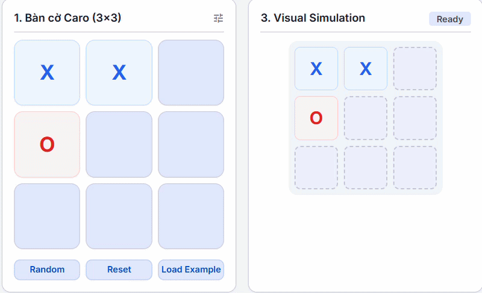
  *Hoạt ảnh Expectimax*

### Nhận xét

- `Minimax` cho nước đi tối ưu tuyệt đối nhưng độ phức tạp tăng theo hàm mũ của độ sâu cây trò chơi.
- `Alpha-Beta` là sự cải tiến vượt bậc, cắt giảm hơn 90% số lượng nút cần duyệt trên bàn cờ Caro 3x3 trống mà vẫn giữ nguyên nước đi tối ưu của Minimax.
- `Expectimax` phản ánh thực tế đối đầu với người chơi nghiệp dư, tối ưu hóa nước đi dựa trên xác suất sai lầm của đối thủ.

---

# 4. Phân tích & So sánh Hiệu suất Chi tiết

Dưới đây là các biểu đồ phân tích hiệu năng được đo lường trực tiếp từ hệ thống chạy thực tế trên các cấu hình kiểm thử tiêu chuẩn. Dữ liệu bao gồm hai chỉ số chính: **Thời gian thực thi (ms)** (trục tung bên trái) và **Số lượng nút đã sinh ra/khám phá** (trục tung bên phải).

---

## 5.1. Nhóm 1: Tìm kiếm mù (Uninformed Search)

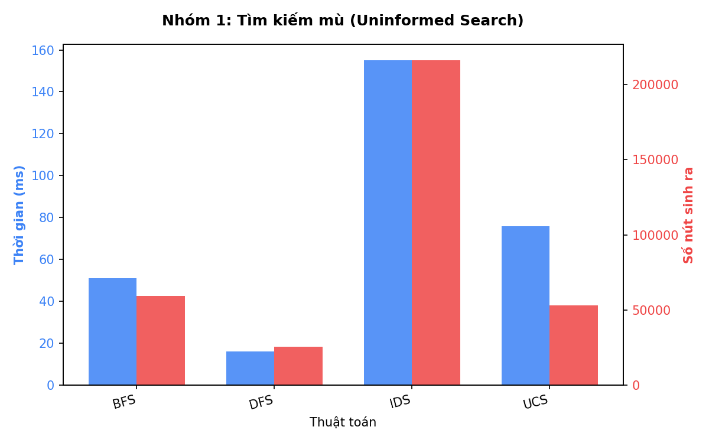

### Nhận xét:

- **Tối ưu độ sâu**: `BFS`, `UCS` và `IDS` đều tìm thấy giải pháp tối ưu với **19 bước đi**. Trong khi đó, `DFS` tìm đường đi dài tới **49 bước** do đặc tính đi sâu vào một nhánh mà không quay lui trừ khi gặp giới hạn.
- **Số nút duyệt**: `IDS` sinh ra nhiều nút nhất (**216,043 nút**, ~155 ms) do cơ chế liên tục duyệt lại các tầng trước đó với giới hạn độ sâu tăng dần.
- **Thời gian chạy**: `DFS` duyệt nhanh nhất (**16 ms**) nhưng kết quả không tối ưu. `UCS` mất **76 ms** để duyệt 53,036 nút do phải quản lý hàng đợi ưu tiên theo chi phí g(n).

---

## 5.2. Nhóm 2: Tìm kiếm có thông tin (Informed Search)

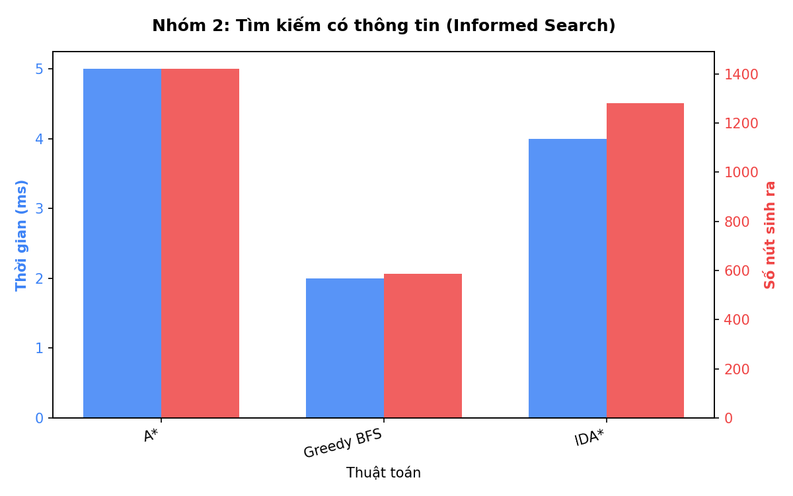

### Nhận xét:

- **Hiệu quả vượt trội**: Nhờ hàm Heuristic (Manhattan Distance), số lượng nút sinh ra của nhóm này giảm xuống mức tối thiểu (chỉ từ 500 đến 1,500 nút), giúp thời gian chạy giảm xuống chỉ còn **dưới 5 ms**.
- **So sánh A\* và IDA\***: Cả hai đều cho kết quả tối ưu 19 bước. `IDA*` duyệt **1,281 nút** (~4 ms), ít hơn so với `A*` (**1,421 nút**, ~5 ms) nhờ cơ chế giới hạn ngưỡng $f(n)$ lặp lại giúp loại bỏ các trạng thái không triển vọng.
- **Greedy BFS**: Duyệt ít nút nhất (**587 nút**, ~2 ms) vì chỉ quan tâm đến giá trị ước lượng $h(n)$ tốt nhất để đi nhanh tới đích. Tuy nhiên, giải pháp của nó không tối ưu (**37 bước**).

---

## 5.3. Nhóm 3: Tìm kiếm cục bộ (Local Search)

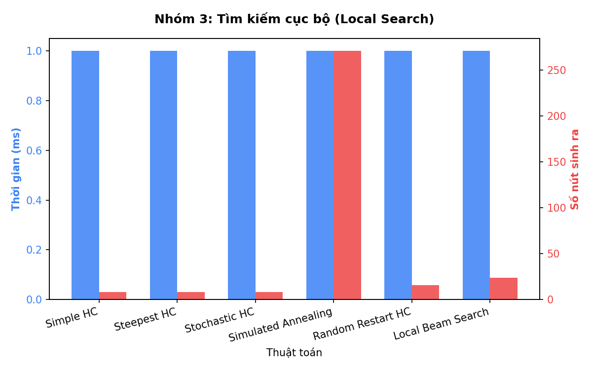

### Nhận xét:

- **Tốc độ cực nhanh**: Nhờ cơ chế chỉ duyệt các trạng thái lân cận mà không lưu cây tìm kiếm, thời gian thực thi của cả nhóm chỉ khoảng **1 ms**.
- **Kẹt cực trị địa phương**: Các thuật toán Hill Climbing cơ bản (`Simple HC`, `Steepest HC`, `Stochastic HC`) dừng lại rất nhanh (chỉ duyệt 8 nút) nhưng thực tế bị kẹt tại cực trị địa phương và không tìm ra lời giải hoàn chỉnh.
- **Vượt bẫy cực trị**: `Simulated Annealing` vượt bẫy thành công nhưng phải đi vòng ngẫu nhiên rất nhiều bước (**246 bước**, 271 nút). `Random Restart HC` và `Local Beam Search` giải quyết hiệu quả hơn với số bước tối ưu chỉ là **5 bước**.

---

## 4.4. Nhóm 4: Tìm kiếm môi trường phức tạp (Complex Environments)

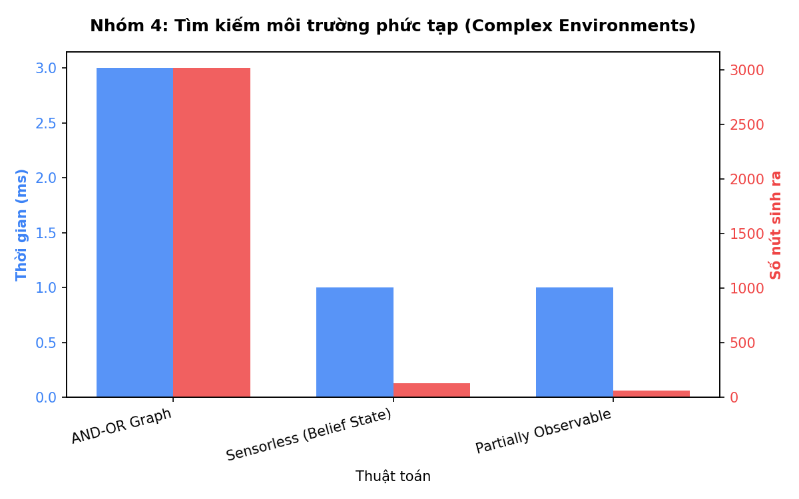

### Nhận xét:

- **AND-OR Graph Search**: Duyệt **3,018 nút** (~3 ms) để tìm ra cây kế hoạch dự phòng tối ưu, đối phó với sự không chắc chắn từ môi trường.
- **Sensorless vs Partially Observable**:
  - `Sensorless Search` (Agent bị mù hoàn toàn) phải dùng các hành động co-ercive ép trạng thái, duyệt **130 nút** (~1 ms).
  - `Partially Observable Search` (Agent quan sát được vị trí ô trống) nhờ cập nhật trạng thái niềm tin liên tục nên chỉ cần duyệt **63 nút** (~1 ms), giảm một nửa số lượng nút cần khám phá.

---

## 4.5. Nhóm 5: Bài toán thỏa mãn ràng buộc (CSP)

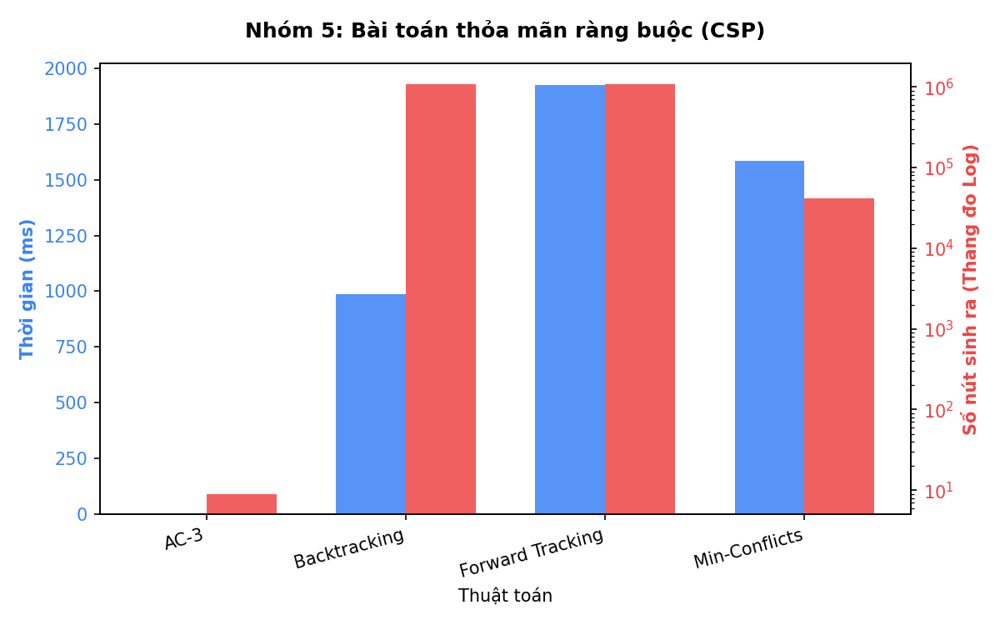

### Nhận xét:

- **AC-3**: Kiểm tra tính nhất quán của các cung ràng buộc và rút gọn miền giá trị cực nhanh, chỉ cần duyệt **9 nút** (~1 ms).
- **Backtracking vs Forward Tracking**: Cả hai đều duyệt số nút khổng lồ (~1.08 triệu nút) do việc chuyển dịch 8-puzzle dưới dạng các ràng buộc sinh ra cây DFS rất sâu.
  - `Forward Tracking` lọc sớm các giá trị không khả thi nên duyệt ít nút hơn một chút (**1,085,438 nút** so với **1,086,230 nút** của Backtracking), nhưng thời gian chạy lâu hơn (**1924 ms** so với **985 ms**) do chi phí kiểm tra nhìn trước (look-ahead) trên mỗi bước duyệt.
- **Min-Conflicts**: Duyệt **41,352 nút** (~1583 ms) để sửa chữa lỗi xung đột cục bộ.

---

## 4.6. Nhóm 6: Tìm kiếm đối kháng (Adversarial Search)

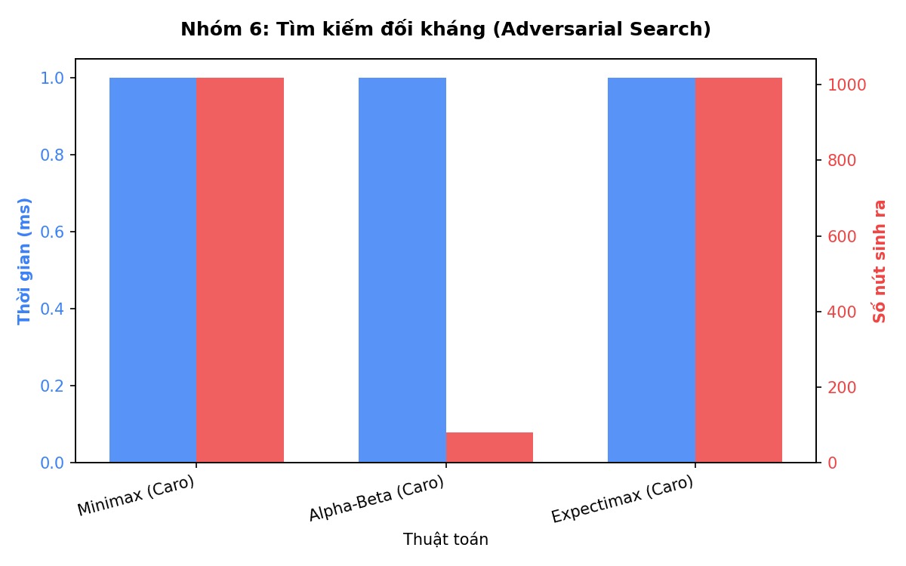

### Nhận xét:

- **Tối ưu hóa cắt tỉa**: Trên bàn cờ Caro 3x3 mẫu, `Minimax` và `Expectimax` bắt buộc phải duyệt toàn bộ cây trò chơi với **1,018 nút**.
- `Alpha-Beta Pruning` nhờ cắt tỉa các nhánh con chắc chắn không được chọn, chỉ cần duyệt **81 nút** (tiết kiệm đến **92.04%** tài nguyên tính toán) mà vẫn đảm bảo chọn ra nước đi tối ưu tương đương Minimax.

---

## 4.7. So sánh hiệu suất tổng thể giữa 6 nhóm

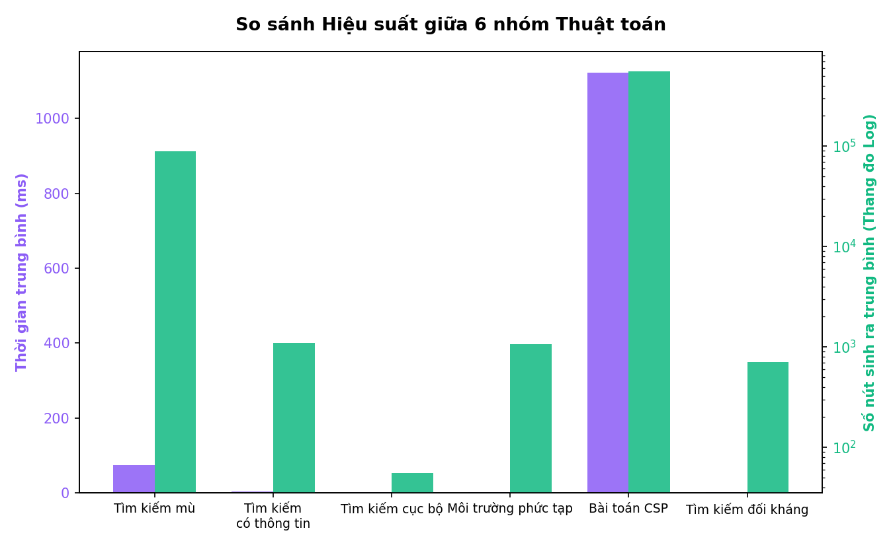

### Nhận xét:

- **Nhóm CSP và Tìm kiếm mù**: Có số lượng nút duyệt trung bình lớn nhất (đều sử dụng cơ chế DFS hoặc lặp lại độ sâu lớn để tìm kiếm trên không gian trạng thái rộng).
- **Nhóm Tìm kiếm có thông tin và cục bộ**: Thể hiện hiệu quả tối ưu nhất với số lượng nút sinh ra cực ít và thời gian xử lý nhanh vượt trội.
- **Nhóm Tìm kiếm đối kháng (Caro 3x3)**: Có thời gian xử lý trung bình rất thấp nhờ bàn cờ nhỏ (3x3) kết hợp với thuật toán Alpha-Beta cắt tỉa hiệu quả.

---

# 5. Kết luận

## 5.1. Kết quả đạt được

Dự án đã xây dựng thành công một chương trình toàn diện mô phỏng 22 thuật toán tìm kiếm trên lưới 8-puzzle và bàn cờ Caro 3x3. Hệ thống hoạt động chính xác, ổn định và có giao diện đồ họa trực quan cao. Người dùng có thể dễ dàng so sánh hiệu năng trực quan giữa các thuật toán dựa trên các số liệu thực tế được đo lường chính xác từ hệ thống.

## 5.2. Khó khăn

Việc tối ưu hóa hiệu năng hiển thị và tránh tràn bộ nhớ đối với các thuật toán tìm kiếm mù có độ sâu lớn đòi hỏi việc quản lý bộ nhớ chặt chẽ. Ngoài ra, việc thiết kế các thuật toán thuộc nhóm CSP và môi trường quan sát một phần để ánh xạ tương thích vào bài toán 8-puzzle đòi hỏi các kỹ thuật chuyển đổi mô hình phức tạp.

## 5.3. Hướng phát triển

- Tích hợp thêm các thuật toán Học máy và Học tăng cường sâu (Deep Reinforcement Learning - DQN) để giải quyết các cấu hình 8-puzzle có độ sâu cực lớn.
- Mở rộng hệ thống để hỗ trợ các bài toán lớn hơn như 15-puzzle hoặc bàn cờ Caro kích thước $5\times 5$, $10\times 10$.
- Bổ sung biểu đồ trực quan hóa dữ liệu so sánh trực tiếp hiệu năng giữa nhiều thuật toán ngay trên giao diện người dùng.

